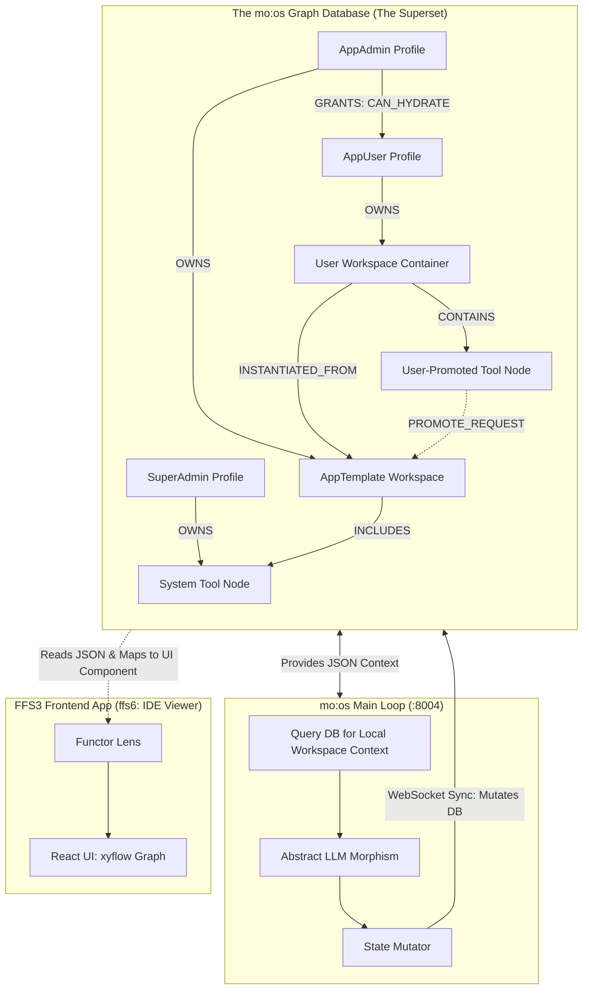

# mo:os Architecture Foundations & Agreements

> Authority: Canonical (current)
> Status: Active source of truth for architectural agreements
> Last affirmed: 2026-03

*Date: March 2026*

This document serves as the intermediate storage for agreements and architectural principles regarding the `mo:os` (Root Container) architecture, the Provider Superset, and the Universal Graph Model.

## 1. Foundational Agreements

1. **The DB is the Strict Source of Truth (Git is Infrastructure)**  
   Codebases (`FFS0` through `FFS3`) hold the engines and UI primitive libraries. The DB holds *all* workflow logic, configurations, and structures.
2. **Strict Actor Boundaries**  
   - *SuperAdmins* build the engine and UI components in Git. JUST 1 SUPERADMIN FFS0T, THERE IS ALSO COLLIDERADMINS FOR FFS1 AND DOWN
   - *AppAdmins* build `AppTemplates` in the DB (arranging nodes/views).
   - *AppUsers* hydrate DB templates into their personal DB array and interact with them.
   - *The LLM* is a co-pilot acting on the specific, hydrated database subgraph.
3. **Unified Context via URN Namespaces**  
   Access is inherently enforced by pointers: `global:core...`, `app:admin...`, `local:user...`.
4. **Everything is a Workspace (The Universal Graph Model)**  
   There are no disparate SQL tables for users, RBAC, chats, or tools. Everything is an Object (NodeContainer). RBAC and relations are just Morphisms (Edges) between nodes (e.g., `User_Bob -> CAN_HYDRATE -> Template_Alpha`).
5. **The Frontend is a Functor Lens**  
   The UI (`ffs6`, `ffs4`) contains zero business logic. It blindly reads the DB JSON via WebSocket and maps node properties to pre-built dumb React components (`@xyflow`, Data Tables, Chat).

---

## 2. The Unified Architecture Diagram (The State/Container Map)

---

## 3. Deep Dive: What is State and Where does it live?

If we strip away semantics and human labels, **State is purely Topological**. 
State is the exact mathematical configuration of the graph (Nodes + Edges) at Time `T`. 

**Where it lives:**
State lives fundamentally in **two places**, creating a hard boundary between *Persistence* and *Computation*:
1. **The Resting State (The DB Base Category)**: This is the persistent record. It is the absolute truth of all URNs and pointers on disk. If the server crashes, the Resting State survives.
2. **The Active State (The `mo:os` Root Container's K/V Cache)**: When a User logs in, the Main Loop does not just query the DB continuously. It creates an *Active State* representing the user's current array of pointers. 
   - **This is where the Loop lives.** The Loop ticks over this in-memory Graph. 
   - If an LLM is running a multi-path reasoning tree, it is mutating the *Active State* (Memory Cache). Only when the loop reaches a logical collapse/conclusion does the Root Container commit the topological delta (the diff) back to the *Resting State* (DB).

State is not a string of text. State is the physical routing of pointers connecting the user to their allowed reality.

---

## 4. Deep Dive: The Interface Problem & The Superset

Moving RL "skills" to agent space creates a huge interface problem. Providers (OpenAI, Anthropic, Gemini) currently treat "skills" as discrete Python functions appended to a prompt. It is fragile, unstructured, and falls apart entirely when you have multi-agent complexities. 

To create our **AI+Human Readable Programming Language** (The Superset), we must ignore the provider's specific paradigms and abstract their "combined features".

**The `mo:os` Superset (The Abstract Syntax):**
Instead of sending the LLM a list of "Skills" (strings of python instructions), we pass the LLM our Superset: **A schema of Graph Mutations**. 
The LLM does not "call tools". The LLM is instructed: *"You are an engine operating on a Graph. Here is the local topology you can see. You may output a JSON array of Morphisms to alter this topology."*

The Superset strictly defines a few foundational operations:
*   `ADD_NODE_CONTAINER (type, properties)`
*   `LINK_NODES (source_urn, target_urn, edge_type)`
*   `UPDATE_NODE_KERNEL (urn, new_data)`
*   `DELETE_EDGE (source_urn, target_urn)`

**Why this solves the Interface Problem:**
A "Skill" is no longer an unstructured Python function. A "Skill" is just a predefined sub-graph template. To "use a skill," the LLM merely executes an `ADD_NODE_CONTAINER` morphism, pointing to the URN of the skill's template. The `mo:os` Loop detects this topology change and runs the corresponding logic in the background. The LLM is acting on pure categorical math, which models are vastly better at navigating than arbitrary Python APIs.

---

## 5. System Execution, Recursion, & Pre-Model Morphisms
Based on refined rules and the integration of insights from *LogicGraph: Benchmarking Multi-Path Logical Reasoning*, the foundations expand into active execution:

### 1. Loop Triggering & The Workstation Model
The `mo:os` Main Loop is **Event-Based**, behaving like a continuous workstation environment or application process, not a simple polling loop. 

### 2. "Before Model" Operations
Configuration and logic that happens *before* the agnostic model call (e.g., selecting the model, setting parameters) live entirely within the Superset. 
- *Category Theory:* The Model is an **Object**; the pre-flight operations acting upon the model are **Morphisms**. 
- *Provider APIs:* Moving forward, the capabilities of OpenAI/Anthropic/Google APIs will be audited to determine if they natively process "nested structures" or if they must be wrapped in strictly our morphisms.

### 3. Banishing "Meta" & The Axiom of Skills
- The word "Meta" is banned, replaced by **"Recursive"**.
- "Skills" from commercial providers lack rigorous interface protocols. **Axiom: No skill metadata is ever precise enough unless it is code.** 
- Instead of using native provider skill concepts (which cause interface collision), `mo:os` favors **Functorial Composition over Task Decomposition**. Platform skills are pulled in (perhaps via MCP) and treated purely as Objects/Morphisms inside the Superset.
- The physical compute of these programmatic skills (whether run locally or distributed) is handled strictly by the `ToolServer` endpoint, separated from the LLM execution.

### 4. Cache, XYFlow, & Active State Sync
For tracking AI exploration context, the system utilizes a **Fast Hot Loading Cache** (or RAM). 
- When an LLM explores multiple logic paths, it mutates memory.
- This uncommitted Active State is synced instantly to the `ffs4` sidepanel and visualized via **XYFlow**, giving humans real-time insight into the AI's internal branching.

### 5. Multi-Path Logical Reasoning (The *LogicGraph* Integration)
Standard Chain-of-Thought (CoT) forces AI into single-path linear thinking. We reject this. 
- `mo:os` structures reasoning as **Directed Acyclic Graphs (DAGs)**. 
- The system must construct reasoning contexts utilizing multi-path inference nodes to preserve logical divergence and inference reuse. The LLM must output edge connections and new nodes (DAG structural morphisms) allowing it to explore and evaluate multiple paths simultaneously before collapsing into a single database commit.

### 6. The AuthUser is an Object
The authentication tier is fully modeled within the graph. `AuthUser` is an **Object**. RBAC limits are inherently structural rules governed by topological boundaries at the Superset level.