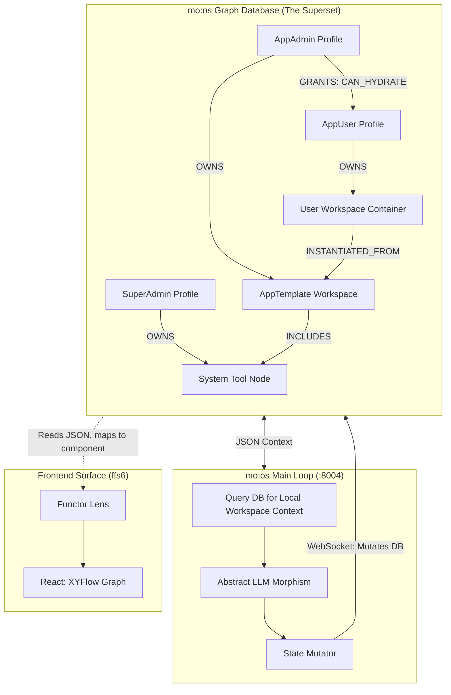

# mo:os

**Multi-Object Operating System** — a runtime kernel for compositional AI-human computation.

> Content IS the application.

---

## What is mo:os?

mo:os is an open-source operating system built on a single axiom: **everything is a Container**. Users, tools, models, applications, memory, UI surfaces, and the OS itself are all the same recursive data structure. State mutates through exactly four typed graph operations. The kernel is written in Go. Persistence is PostgreSQL + pgvector. The model layer is provider-agnostic. The math is category theory.

Traditional systems silo data into files and constrain logic inside applications. mo:os dissolves these boundaries. Data, logic, and context exist as nodes in a shared spatial graph. You don't open an app — you navigate a topology. The data structures themselves render the interface.

### The One Axiom

A **Container** is a typed node with:
- A **URN** (universal resource name) for global addressing
- A **kernel** (opaque payload — the content)
- An **interface** (typed input/output ports via JSON Schema)
- **Permissions** (ACL entries governing access)
- A **parent** pointer (recursive nesting)
- **Wires** (typed edges connecting ports to other containers)

The same structure appears at every scale: an `.agent/` folder on disk, a `node.container` row in the database, a `user.container` in the admin graph. A project holds a workspace, which holds a document, which holds an agent, which holds a sub-project. Infinite addressable depth, perfect fractal scoping.

---

## Why mo:os Exists

### The Interface Problem

AI providers treat "skills" as discrete Python functions appended to a prompt. This is fragile, unstructured, and falls apart at multi-agent complexity. mo:os replaces this with the **Superset**: a schema of graph mutations. The LLM doesn't "call tools" — it outputs morphisms against a local topology. A skill is a sub-graph template. To use a skill, the LLM adds a container pointing to that template's URN. The kernel detects the topology change and executes the corresponding logic. Models navigate pure categorical math, which they handle far better than arbitrary APIs.

### The State Problem

Chat history is not state. State is **topological** — the exact configuration of nodes and edges at time T. mo:os makes this explicit with two physical boundaries:

1. **Resting State** (PostgreSQL) — persistent, survives crashes, the absolute truth of all URNs and pointers on disk
2. **Active State** (in-memory cache) — hydrated when a user starts a session; the kernel's event loop ticks over this graph; mutations stay in memory until logical collapse, then commit the topological delta back to the Resting State

### The Reasoning Problem

Chain-of-Thought (System 2) forces single-path sequential reasoning. One early hallucination collapses the entire chain. mo:os implements **System 3 reasoning** — structuring inference as a Directed Acyclic Graph with multi-path branching, parallel exploration, and verification before commitment.

### The Ownership Problem

Context trapped in proprietary provider servers is not user-owned. mo:os is a sovereign hub: contextual memory lives in the user's own graph database, vector-embedded at write time, queryable by any connected model via MCP. Swap providers without losing a single node.

---

## Architecture

```
                        ┌─────────────────────────────┐
                        │     Browser Surfaces         │
                        │  (React 19 / XYFlow / Zustand)│
                        │                             │
                        │  ffs6: IDE Viewer    :4200  │
                        │  ffs4: Sidepanel     :4201  │
                        │  ffs5: PiP           :4202  │
                        └────────────┬────────────────┘
                                     │ WebSocket (JSON-RPC)
                                     │ Functorial Lens:
                                     │   Get = project state → UI
                                     │   Put = UI edit → morphism
                        ┌────────────▼────────────────┐
                        │     mo:os Kernel (Go)        │
                        │                             │
                        │  Event Loop:                │
                        │    hydrate → mutate → delta │
                        │                             │
                        │  Active State Cache (Redis) │
                        │  Morphism Executor          │
                        │  LLM Provider Adapters      │
                        │  Tool Runtime (sidecar)     │
                        │                             │
                        │  :8000  Data API            │
                        │  :8080  MCP/SSE             │
                        │  :8004  Agent Compatibility  │
                        │  :18789 NanoClaw WS Bridge  │
                        └────────────┬────────────────┘
                                     │ pgx/v5
                        ┌────────────▼────────────────┐
                        │   PostgreSQL + pgvector      │
                        │                             │
                        │  containers (JSONB)         │
                        │  wires (edges)              │
                        │  morphism_log (audit)       │
                        │  vector embeddings (HNSW)   │
                        │                             │
                        │  Resting State =            │
                        │    source of truth          │
                        └─────────────────────────────┘
```

The **frontend contains zero business logic**. It is a functorial projection — a mathematical lens that extracts a view from backend state (Get) and translates user edits back into morphisms (Put). If the kernel mutates a container, the surface re-renders. That's it.



---

## The Four Morphisms

All state change in mo:os collapses into four categorical operations — the complete algebra:

| Morphism | Operation | Effect |
|----------|-----------|--------|
| **ADD** | Create a container node | Inserts a new object into the graph with URN, kind, interface, kernel, permissions |
| **LINK** | Create a wire between ports | Connects `from_port` on source container to `to_port` on target container |
| **MUTATE** | Update a container's kernel | Conditional on `expected_version` (optimistic concurrency); bumps version counter |
| **UNLINK** | Dissolve a wire | Removes the edge, freeing containers to reorganize |

These four operations are **categorically closed**: sequential composition (`f ; g`) and parallel composition (`f ⊗ g`) of morphisms produce valid morphisms. Every container has an identity morphism (passthrough wiring). Associativity holds. This means the system is mathematically sound — any syntactically valid composition has well-defined runtime behavior.

The LLM outputs morphisms as JSON inside markdown code fences. The kernel's parser extracts them, validates types and schemas, and dispatches to the executor. Every operation is logged to an append-only audit trail for full traceability and replay.

```json
{
  "type": "ADD",
  "actor_urn": "user:bob",
  "scope_urn": "app:2xz",
  "add": {
    "container": {
      "urn": "node:abc123",
      "parent_urn": "app:2xz",
      "kind": "Document",
      "kernel_json": { "title": "Project Brief", "body": "..." }
    }
  }
}
```

---

## The Superset

Instead of sending an LLM a list of tool definitions (strings of Python instructions), mo:os passes the LLM a **Superset schema of graph mutations**:

> *"You are an engine operating on a Graph. Here is the local topology you can see. You may output a JSON array of Morphisms to alter this topology."*

The Superset strictly defines foundational operations: `ADD` (container), `LINK` (wire), `MUTATE` (kernel), `UNLINK` (wire). Skills, tools, models, memory — all are containers in the graph, manipulated through the same four morphisms. This resolves the interface collision problem that plagues native provider skill systems.

**Functorial composition over task decomposition.** Platform skills (whether from MCP, native APIs, or custom code) are pulled in and treated purely as objects and morphisms inside the Superset. The physical compute of programmatic skills is handled by the ToolServer endpoint, separated from LLM execution.

---

## System 3 Reasoning

| System | Method | Limitation |
|--------|--------|------------|
| **System 1** | Next-token prediction | Semantic fluency without logical grounding |
| **System 2** | Chain-of-Thought (CoT) | Single-path; one hallucination collapses the chain |
| **System 3** | DAG multi-path reasoning | Parallel exploration with neuro-symbolic verification |

mo:os implements System 3 as a first-class runtime feature:

1. **Fork** — When the model faces a complex decision, the kernel forks the Active State Cache into parallel, isolated branches. Each branch gets its own goroutine.
2. **Explore** — Branches execute morphisms independently. Multiple reasoning paths are pursued simultaneously.
3. **Score** — Neuro-symbolic evaluators translate generated actions into formal logic. Branches are scored for structural validity and goal alignment against error taxonomies (semantic comprehension errors, logical execution errors).
4. **Prune** — Low-scoring, near-miss, and redundant branches are discarded.
5. **Collapse** — The winning branch commits its topological delta to the Resting State. The DAG collapses back to a single consistent state.

This branching is visualized in real-time via XYFlow in the Chrome sidepanel, giving humans direct insight into the AI's internal reasoning topology.

---

## Research Foundations

mo:os draws from six intersecting research areas:

**Category Theory & Functorial Semantics** — Lawvere's *Functorial Semantics of Algebraic Theories* (1963); Fong & Spivak's *Seven Sketches in Compositionality* (2018). Containers are objects, morphisms are arrows. The syntax category (container schema) and semantics category (runtime execution) are related by a structure-preserving functor. Operads provide the recursive nesting grammar. Frobenius structure enables wire splitting, joining, and parallel computation.

**Multi-Path DAG Reasoning** — *LogicGraph: Benchmarking Multi-Path Logical Reasoning* (2025). Demonstrates that structuring inference as DAGs with multi-path branching and evaluation before commitment significantly outperforms linear Chain-of-Thought.

**Functorial Unification of Logic Programming** — *Functorial Semantics as a Unifying Perspective* extends classical logic programming through categorical abstraction to probabilistic and weighted domains, providing the formal bridge between syntax (container schemas) and semantics (runtime behavior).

**Graph Databases & JSONB Modeling** — PostgreSQL as universal store. JSONB for flexible, queryable nested structures. Recursive CTEs for graph traversal. pgvector with HNSW indexes for semantic search. One dependency instead of a dedicated graph DB, document store, and vector DB.

**Distributed Systems** — Optimistic concurrency via monotonic version counters. Future federation: CRDTs for container data convergence, Raft for structural morphism ordering.

**Agent Memory Architecture** — Every piece of user memory is a container in the graph, vector-embedded at write time, queryable via MCP. Unlike flat vector stores, mo:os memory has recursive structure, typed interfaces, permissions, and compositional algebra.

---

## Technical Stack

### Backend — Go 1.23+

| Component | Library | Purpose |
|-----------|---------|---------|
| HTTP | `net/http` + `chi` | REST API, health checks |
| WebSocket | `gorilla/websocket` | Gateway, JSON-RPC bidirectional |
| Database | `jackc/pgx/v5` | Connection pooling, JSONB, recursive CTEs |
| Cache | `redis/go-redis/v9` | Active State Cache, event pubsub |
| JSON Schema | `santhosh-tekuri/jsonschema` | Port validation, interface compatibility |
| Protobuf | `google.golang.org/protobuf` | Wire format for internal IPC |
| Logging | `log/slog` | Structured JSON output |

Build: `go build -o moos-kernel ./cmd/kernel` produces a single static binary.

### Frontend — React 19

| Component | Library | Purpose |
|-----------|---------|---------|
| Framework | React 19 | Component rendering |
| Build | Vite 7 | Dev server + production builds |
| Monorepo | Nx 22 | Workspace management (ffs4/ffs5/ffs6) |
| Graph | @xyflow/react | Container graph visualization |
| State | Zustand | Client-side container graph store |
| Styling | TailwindCSS 4 | Utility-first CSS |
| Types | TypeScript 5.9 | Strict mode throughout |

### LLM Providers

Adapter pattern — pluggable, provider-agnostic:

| Provider | Model | Status |
|----------|-------|--------|
| Gemini | gemini-2.5-flash | Default |
| Anthropic | claude-sonnet-4-6 | Supported |
| Google Vertex | Claude on GCP | Supported |
| OpenAI | — | Planned |

---

## Repository Structure

```
FFS0_Factory/
├── .agent/                                     Root governance context
│   ├── index.md                                Governance summary
│   ├── manifest.yaml                           Inheritance: includes/exports
│   ├── instructions/                           Base intent contracts
│   ├── rules/                                  Hard constraints
│   │   ├── sandbox.md                          Path and behavioral boundaries
│   │   ├── code_patterns.md                    NodeContainer, two-graph, morphisms
│   │   ├── public_repo_safety.md               No secrets, review gates
│   │   └── env_and_secrets.md                  Environment variable management
│   ├── configs/                                Shared settings shapes
│   ├── knowledge/                              Canonical architecture references
│   │   ├── moos_architecture_foundations.md    Source of truth for agreements
│   │   ├── moos_developers_vision.md           Technical developer brief
│   │   └── moos_implementation_details.md      Phased implementation plan
│   └── workflows/                              Runbooks
│       ├── conversation-state-rehydration.md   Context restore protocol
│       ├── db-sync-contract.md                 Filesystem → DB sync
│       └── pre-public-readiness-checklist.md   Validation before visibility flip
│
├── sdk/                                        Seeder + runtime tools
│   ├── seeder/                                 Filesystem → DB node sync
│   │   ├── agent_walker.py                     Walks .agent/ directories
│   │   ├── node_upserter.py                    Upserts to DataServer
│   │   └── cli.py                              CLI entry point
│   └── tools/
│       └── collider_tools/                     Atomic tool implementations
│           ├── nodes.py                        Container CRUD
│           ├── apps.py                         Application operations
│           ├── permissions.py                  RBAC operations
│           └── graph.py                        Tool discovery + registration
│
├── models/                                     Shared Python domain models
│
├── workspaces/
│   ├── FFS1_ColliderDataSystems/               Governance + shared contracts
│   │   ├── .agent/                             FFS1 governance layer
│   │   │
│   │   ├── FFS2_Collider...ChromeExtension/    Backend services
│   │   │   ├── .agent/                         FFS2 governance layer
│   │   │   └── moos/                           Active Go runtime
│   │   │       ├── cmd/kernel/                 Entry point + WebSocket gateway
│   │   │       └── internal/
│   │   │           ├── morphism/               ADD/LINK/MUTATE/UNLINK executor
│   │   │           ├── container/              Container + wire schemas
│   │   │           ├── model/                  LLM output parser
│   │   │           ├── session/                Session management
│   │   │           ├── tool/                   Tool execution runtime
│   │   │           └── config/                 Environment configuration
│   │   │
│   │   └── FFS3_Collider...FrontendServer/     Frontend applications
│   │       ├── .agent/                         FFS3 governance layer
│   │       ├── apps/
│   │       │   ├── ffs6/                       IDE Viewer (:4200)
│   │       │   ├── ffs4/                       Chrome Sidepanel (:4201)
│   │       │   └── ffs5/                       Picture-in-Picture (:4202)
│   │       └── libs/shared-ui/                 Internal design system
│   │
│   └── maassen_hochrath/                       Secondary workspace
│
└── secrets/                                    Environment files (gitignored)
```

### Governance Inheritance

```
FFS0/.agent → FFS1/.agent → FFS2/.agent + FFS3/.agent → ffs4/ffs5/ffs6/.agent
```

Each level's `manifest.yaml` declares `includes` (what it inherits from parent) and `exports` (what it makes available to children). Strategy: **deep merge** at every level, minimal exports to keep inheritance deterministic.

---

## Service Ports & Protocols

| Port | Service | Protocol | Purpose |
|------|---------|----------|---------|
| 8000 | MOOS Data Server | REST + SSE | Container CRUD, morphism API, OpenClaw bootstrap |
| 8080 | MOOS MCP Server | SSE + JSON-RPC | Model Context Protocol endpoint |
| 8004 | MOOS Agent Runner | REST | Session management, context composition |
| 18789 | NanoClaw Bridge | WebSocket (JSON-RPC) | Agent chat gateway |
| 4200 | ffs6 (IDE Viewer) | HTTP | Primary frontend surface |
| 4201 | ffs4 (Sidepanel) | HTTP | Chrome extension sidepanel |
| 4202 | ffs5 (PiP) | HTTP | Picture-in-Picture surface |

**Register MCP endpoint:**
```bash
claude mcp add collider-tools --transport sse http://localhost:8080/mcp/sse
```

---

## Access Control

RBAC in mo:os is not a separate SQL table — it is **graph topology**. Permissions are morphisms (edges) between nodes. Access is inherently structural.

### Actor Boundaries

| Actor | Scope | Domain |
|-------|-------|--------|
| **SuperAdmin** | Build engine and UI primitives | Git codebase |
| **ColliderAdmin** | Manage workspace governance | FFS1 and below |
| **AppAdmin** | Build AppTemplates (arrange nodes/views) | Database |
| **AppUser** | Hydrate templates into personal workspace | Database |
| **LLM** | Co-pilot on specific hydrated subgraph | Active State |

### URN Namespace Enforcement

Access is inherently governed by pointer scope:
- `global:core...` — system-wide resources (SuperAdmin)
- `app:admin...` — application-scoped templates (AppAdmin)
- `local:user...` — user-owned workspace instances (AppUser)

Every morphism is attributed to an `actor_urn` and scoped to a `scope_urn`. The morphism log provides a complete audit trail.

---

## The .agent Governance System

Every workspace in the monorepo can contain an `.agent/` directory — a filesystem representation of the same NodeContainer pattern that exists in the database.

| Directory | Purpose |
|-----------|---------|
| `instructions/` | Base intent contracts |
| `rules/` | Hard constraints (sandbox, code patterns, safety) |
| `skills/` | Composable capability definitions |
| `tools/` | Tool schemas with `code_ref` pointers |
| `configs/` | Shared settings shapes |
| `knowledge/` | Canonical reference documents |
| `workflows/` | Executable runbooks |

The **SDK Seeder** (`sdk/seeder/`) walks the filesystem, discovers all `.agent/manifest.yaml` files, builds NodeContainer objects, and upserts them to the Data Server. This is the filesystem-to-database sync bridge.

```bash
uv run python -m sdk.seeder.cli --root D:/FFS0_Factory --app-id <uuid>
```

**Context rehydration read order** (for new sessions):
1. Root `CLAUDE.md`
2. Workspace `CLAUDE.md`
3. Workspace `.agent/index.md`
4. Workspace `.agent/manifest.yaml` (includes/exports)

---

## Getting Started

### Prerequisites

- Go 1.23+
- Node.js 20+ with pnpm
- PostgreSQL 16+ with pgvector extension
- Redis 7+
- Python 3.12+ with UV (for SDK tools)

### Run the Stack

```powershell
# Full stack (PowerShell)
./workspaces/FFS1_ColliderDataSystems/start-moos-stack.ps1

# Or individually:
# Backend
cd workspaces/FFS1_ColliderDataSystems/FFS2_ColliderBackends_MultiAgentChromeExtension/moos
go run ./cmd/kernel

# Frontend
cd workspaces/FFS1_ColliderDataSystems/FFS3_ColliderApplicationsFrontendServer
pnpm nx serve ffs6
```

### Run Tests

```bash
# Go backend (46 tests, 94% model coverage)
cd workspaces/FFS1_ColliderDataSystems/FFS2_ColliderBackends_MultiAgentChromeExtension/moos
go test ./...

# Frontend (22 vitest tests)
cd workspaces/FFS1_ColliderDataSystems/FFS3_ColliderApplicationsFrontendServer
pnpm nx test ffs4

# Type checking
pnpm nx run ffs6:typecheck
```

---

## Contributing

- **Commits**: Conventional Commits (`feat:`, `fix:`, `chore:`, `docs:`)
- **Scope**: All changes stay within `FFS0_Factory/`
- **Governance**: Treat `.agent/manifest.yaml` inheritance as authoritative wiring; validate `includes` and `exports` paths after any `.agent` changes
- **Safety**: Follow `.agent/rules/public_repo_safety.md` — no secrets, no sensitive infrastructure details, review gates before visibility changes
- **Pre-public**: Run `.agent/workflows/pre-public-readiness-checklist.md` before any visibility flip

---

## Roadmap

| Phase | Focus | Status |
|-------|-------|--------|
| 0 | Specification, ontology wiring, container schema | Complete |
| 1 | Go kernel foundation, four morphisms, PostgreSQL schema, provider adapter | Active |
| 2 | Persistent main loop, Active State Cache, workspace context, tool execution | Active |
| 3 | Tool runtime sidecar, surface integration, collaborative editing | Planned |
| 4 | Dockerize, health checks, monitoring, TLS, backups | Planned |
| 5 | Multi-path DAG reasoning, federation (CRDTs/Raft), WASM sandbox, WebRTC peer surfaces | Future |

---

## License

License TBD.

---

*Everything is a container. Containers compose. The algebra is closed. Welcome to mo:os.*
