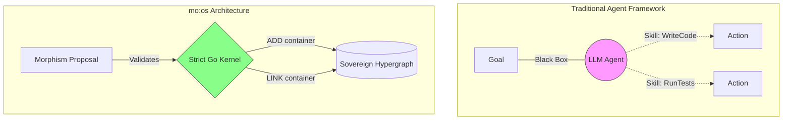
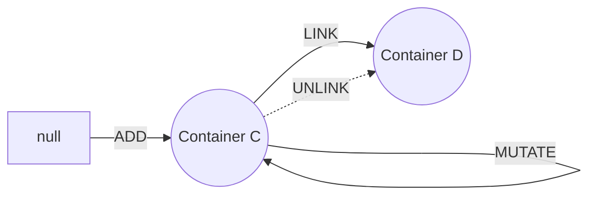
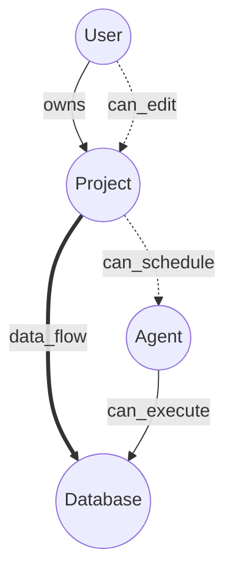
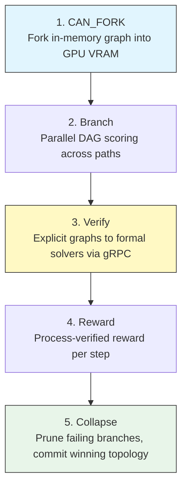
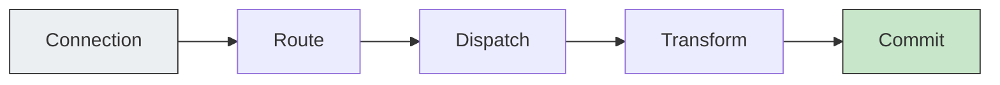

# mo:os

**Multi-Object Operating System** — a categorical kernel for sovereign AI computation.

> _"Let corporate have their cookies and chatbots — We'll keep our tiny data."_

---

## ⚡ At A Glance

- **What it is:** A neuro-symbolic OS turning prompts into verifiable graph mathematics.
- **Why it matters:** Eliminates the "Interface Problem" where AI swarms hallucinate intermediate logic.
- **How it works:** Replaces arbitrary agent "skills" with exactly 4 atomic operations (`ADD`, `LINK`, `MUTATE`, `UNLINK`) over a sovereign PostgreSQL hypergraph.
- **The Engine:** An LLM proposing graph morphisms, verified by a strict Go kernel before executing.

---

## The Problem: Skills Are Dead

The AI industry has a vocabulary crisis.

**Skills. Intents. Chains-of-thought. Agentic workflows. Tools. Purposes.** These are marketing labels glued onto boxes nobody opened. They are unstructured natural language for task decomposition — OOP thinking applied to AI, focused on viewing data as objects consisting of metadata and other objects. Entities. Models. Schemas. Every year a new buzzword: _what's next, "purpose"?_

Here is what they all share: **they describe the stickers on the boxes, not the logic inside them.**

When you decompose a task into subtasks — a "real estate agent" calling an "accountancy agent" calling a "document parser" — you are delegating based on labels. The ports of each interface expose a merged summary of internal morphisms, but the outside doesn't know or care about that internal logic. This creates a **fundamental recursive caveat**: the gap between what was decomposed and what actually executes widens at every layer. The morphisms are not discrete. They fractalize. And the metadata — the docstrings, the tool descriptions, the "skill specifications" — cannot close this gap because **metadata is not logic**.

This is the **Interface Problem**: human concepts placed into machines arrive stripped of the real-life context that humans rely on when choosing. A human accountant doesn't operate from a docstring. They operate from years of situated knowledge, professional convention, regulatory memory, and environmental awareness. None of that travels through a tool description. What travels is a label and a JSON schema. The rest is prayer.

Task decomposition focused on stickers is inherently incomplete. The person who delegates cannot predict all outcomes the machine will produce unless they know the code — the actual morphism structure. But software engineers already know this: **a composed system of tasks is not the same as one program containing all the dependency lines.** The interfaces lie. The contracts leak. The semantic layers pile up without conventions, and what you get is organized workspaces surrounded by unnoticed metadata that was never formalized.

When Google introduced the Transformer architecture in 2017, it hit something deep. It looked like reasoning. It isn't. Large Language Models prioritize **semantic fluency over logical entailment**. They build linguistically plausible but logically invalid bridges between known start states and expected end states — what the research calls **result-oriented hallucination**. The model sees the answer is 42, writes a page of plausible-looking equations, and draws a box around 42 at the bottom. The intermediate steps are semantic decoration, not causal derivation.

This doesn't break down gently. It breaks down catastrophically with complexity. Compound it across 10 agents in a swarm, each committing the same six categories of logical error — semantic misinterpretation, information omission, fact hallucination, invalid deduction, rule misapplication, insufficient premise — and you get noise amplified through a pipeline that was supposed to produce intelligence.

**We need to stop making code human-readable and start making human knowledge AI-readable.** Code — graph structure, JSON topology — is already machine-native. What's missing is the formalization of _human context_ into structures that compose mathematically, not semantically.

mo:os is that structure.



---

## The One Axiom

Everything in mo:os reduces to a single primitive:

```
For all x in System:  x = (URN, fold(morphism_log))
```

A **Container** is a typed node identified by a URN (universal resource name). It has no intrinsic type, no class, no schema beyond what morphisms have written into it. Its current state is a materialized view of its morphism history — not a source of truth. The append-only morphism log IS truth. If the state corrupts, replay the log. If the cache drifts, fold the history. Time-travel to any point by replaying morphisms up to that timestamp.

Users, tools, models, applications, memory stores, UI surfaces, infrastructure services, and the OS itself are all the same recursive data structure. **A node is nothing** — it is a bus stop for state. It carries edges, arrows to new state. If state changes, it is because of a node, therefore container. The node is an access-controlled index to metadata and a pointer to code. It is not the logic. It holds pointers to logic — its edges.

There is no metadata layer. Only containers referencing containers via wires. This is Axiom 1: **No_Meta_Only_Recursive**.

### Four Operations. No More.

Every state change in the system decomposes into exactly four invariant natural transformations:

| Operation  | Signature    | What It Does                              |
| ---------- | ------------ | ----------------------------------------- |
| **ADD**    | `null -> C`  | Create a container (URN enters the graph) |
| **LINK**   | `C x C -> W` | Create a wire between two containers      |
| **MUTATE** | `C -> C`     | Update a container's state (endomorphism) |
| **UNLINK** | `W -> null`  | Remove a wire (edge leaves the graph)     |



There is no fifth operation. **DELETE for containers is deliberately absent** — you can only UNLINK edges, making a container an orphan (invisible to traversal but preserved in the log). Every "skill," "tool," "workflow," and "agent action" in the industry decomposes into these four. The 13 morphisms in our superset ontology (OWNS, CAN_HYDRATE, CAN_SCHEDULE, CAN_FORK, CAN_FEDERATE, etc.) are all compositions of ADD, LINK, MUTATE, and UNLINK. Nothing else exists.

Each morphism is atomic: no cascading side effects, no implicit operations, no hidden coupling. LINK doesn't MUTATE. ADD doesn't auto-LINK. Composition is explicit via sequential execution. **The structure guarantees the behavior.**

### Show, Don't Tell

Consider adding a specialized "QA Agent" to your system that validates code logic.

In a traditional framework, you might write a python script calling `register_agent("QA")`.
In **mo:os**, you commit explicit graph topology:

```json
[
  {
    "type": "ADD",
    "urn": "urn:container:agent:qa",
    "payload": { "name": "QA Agent" }
  },
  {
    "type": "LINK",
    "source_urn": "urn:container:dev:env",
    "target_urn": "urn:container:agent:qa",
    "port": "owns"
  },
  {
    "type": "LINK",
    "source_urn": "urn:container:agent:qa",
    "target_urn": "urn:container:tool:linter",
    "port": "can_execute"
  }
]
```

The exact state of the system is now transparent, traversable, and logically provable before execution.

---

## Purpose: To Use and Produce Knowledge

Not skills. Not tools. Not intents. **Knowledge.**

### The Knowledge Equation

For a directed multi-port hypergraph with `n` nodes, where each node has `|P_s|` source ports and `|P_t|` target ports:

```
Potential edges  = n^2 x |P_s| x |P_t|
Actual edges     = k        (where k << potential)
Knowledge        = potential - k
```

The rules that filter potential edges into actual edges ARE the system's intelligence. Every business rule, permission check, schema constraint, and ontological decision is a filter that reduces billions of potential connections to the thousands that actually exist. **The gap IS the knowledge.**

### Discovery vs. Retrieval: Delegating vs. Doing

```
Discovery cost  = O(|E_scope| x c_index)    -- scanning the graph
Retrieval cost  = O(k + 1)                  -- fetching from pre-solved index
```

Discovery is data-expensive. You must scan edges, evaluate metadata density, check permissions, traverse port types. This is _delegating_ — figuring out what to do.

Retrieval is asymptotically free. Once the graph structure is solved, fetching is a batch lookup against a pre-computed index. This is _doing_ — executing with known context.

The **D/R ratio** (Discovery / Retrieval cost) per sub-category is a first-class optimization metric:

| D/R Profile | Meaning                            | Strategy                                   |
| ----------- | ---------------------------------- | ------------------------------------------ |
| High D      | Schema evolving, edges changing    | Pre-compute and cache subgraph structure   |
| High R      | Schema stable, fetching known data | Optimize batch fetching, compress payloads |
| D = R       | Balanced                           | Monitor for drift                          |

The number of edges characterizes knowledge discovery cost. The number of nodes characterizes retrieval cost. **Optimizing this ratio is optimizing the flow of knowledge through the system.**

### Making Human Knowledge AI-Readable

The industry has it backwards. We don't need to make code human-readable — code (graph structure, JSON topology) is already AI-native. What we need is to formalize the unstructured human knowledge that surrounds every tool, every workflow, every "skill" — the professional conventions, the domain constraints, the environmental dependencies, the IRL context — into structured graph topology that composes categorically.

Build your knowledge in the collider hypergraph. Connect semantics to syntax. Report performance. Use examples as the bridge between human understanding and machine structure. Classification, enumeration, structured metadata — these are semantics disguised as syntax, declarative not imperative, but essential for findability when referring to known conventions. **This is building from the bottom up, not layering metadata from the top down.**

---

## Hypergraph Superposition

The database stores **THE** graph — a superposition of all possible projected graphs:



`G_stored = Union over all port types { G_p }`

Multiple wires between the same pair (A, B) via different ports is the **general case**, not an edge case. A single pair can simultaneously have an OWNS wire, a CAN_HYDRATE wire, a data-flow wire, and a template-binding wire. The uniqueness constraint is the 4-tuple: `(source_urn, source_port, target_urn, target_port)`.

**Query collapses superposition.** Selecting `WHERE source_port = 'owns'` projects the ownership tree. Selecting `WHERE source_port = 'can_execute'` projects the capability graph. Different queries, different projections, same underlying data. No separate tables. No separate databases. One hypergraph, many views.

What the single graph simultaneously encodes:

- Ownership trees (port: `owns`)
- Permission graphs (port: `can_hydrate`)
- Data flow DAGs (port: `data_flow`)
- Template hierarchies (port: `template`)
- Agent capability graphs (port: `can_execute`)
- Compute scheduling (port: `can_schedule`)
- Federation topology (port: `can_federate`)

**Forget the dots and boxes of OOP. It's the flow. The interface IS the data.** Optimize data interface flow by category and functor. A node in the collider hypergraph is a bus stop — what matters is the edges, the morphisms, the state transitions flowing through it. A hypernode can hold multiple states at the same memory location instead of topologically dispersing them. That's having all tools in hand instead of one tool in hand and the rest on the belt.

---

## System 3 Reasoning: Beyond Semantic Bridges

### The Failure Mode

LLMs trained on next-token prediction and outcome-based reward functions learn to generate text that _looks like_ formal proof on a semantic level and ends with the correct target. The intermediate steps receive positive gradient updates regardless of logical validity. The model never learned logic — it learned to build bridges out of language.

Research (LogicGraph, 2026) identifies six recurring error types in LLM reasoning:

1. **Semantic misinterpretation** — confusing causality direction ("if A then B" becomes "if B then A")
2. **Information omission** — ignoring critical premises
3. **Fact hallucination** — inserting claims contradicting or absent from context
4. **Invalid deduction** — logically flawed derivation steps
5. **Rule misapplication** — applying rules where preconditions aren't met
6. **Insufficient premise** — concluding from necessary-but-not-sufficient conditions

These errors compound multiplicatively across multi-agent pipelines. Each agent in a swarm commits them independently. The output is noise with confident formatting.

### The Neuro-Symbolic Escape

mo:os does not ask LLMs to reason. It uses them as **Fuzzy Processing Units** — sandboxed coprocessors that _propose_ morphisms. The kernel validates every proposal against graph structure before committing. The kernel IS the symbolic engine.

The System 3 pipeline:



**Why process-verified?** For a composed pipeline where agent A fans out to subtasks {f1, f2, f3}, the benchmark must verify:

```
B(f3 . f2 . f1) = B(f3) . B(f2) . B(f1)
```

Outcome-only evaluation checks the left side. Process-verified evaluation checks the right side AND the equation. This is the **functoriality condition** — the categorical reason why step-by-step verification outperforms final-answer grading. If you only evaluate the final output, you lose the compositional structure that makes evaluation meaningful.

**State, not stateless.** The LLM is not in request-response mode. It is a node in the graph — a state-transforming morphism. Its behavior is the result of composition across different semantic categories. Without interchangeability (functors with benchmarks), you can't know if one model's composition preserves the same structure as another's.

---

## Architecture: The Categorical Kernel

### The Pipeline

The Go kernel implements a single pipeline that reduces every external event to a morphism:



| Stage          | Does                                     |
| -------------- | ---------------------------------------- |
| **Connection** | Accept transport (HTTP, WS, MCP/SSE)     |
| **Route**      | Parse request -> determine morphism type |
| **Dispatch**   | Validate against graph state             |
| **Transform**  | Apply morphism to state                  |
| **Commit**     | Append to morphism_log, update caches    |

This pipeline IS the reducer `Sigma: Log -> State` — the colimit of the morphism chain applied one message at a time. Each request enters as syntax (HTTP/WS payload) and exits as committed semantics (morphism in the log).

### Transport Surfaces

Transport surfaces are **morphisms in the category, NOT functors**. They are infrastructure that carries morphisms within the graph. Adding a new transport creates a new wire, not a new functor.

| Surface             | Port  | Protocol           |
| ------------------- | ----- | ------------------ |
| Data compatibility  | 8000  | HTTP REST          |
| Agent compatibility | 8004  | HTTP REST          |
| MCP endpoint        | 8080  | SSE stream         |
| NanoClaw bridge     | 18789 | WebSocket JSON-RPC |

These four are a **coslice category** — fan-out from the kernel node. The forgetful functor recovers target containers from the fan-out structure. Protocol-specific concerns (auth headers, SSE framing, WS handshake) are handled at Connection and stripped before Route.

### Five Genuine Functors

Structure-preserving maps from the graph category to external domains:

| Functor        | Maps                                 | Status  |
| -------------- | ------------------------------------ | ------- |
| **FileSystem** | `manifest.yaml -> wires`             | Active  |
| **UI_Lens**    | `containers x wires -> React tree`   | Active  |
| **Embedding**  | `state_payload -> R^1536 (pgvector)` | Active  |
| **Structure**  | `subgraph -> compressed DAG (GPU)`   | Planned |
| **Benchmark**  | `C_provider -> C_standard`           | Planned |

**Anti-pattern: Functor-as-Metadata.** Never store functor output in `state_payload`. Embeddings go in `container_embeddings`. UI state goes in React virtual DOM. GPU analysis stays in GPU memory. Violating this creates circular dependencies — the graph containing its own projections.

### Provider Agnosticism

A Large Language Model is a CPU that we map container schemas onto. If a provider degrades, swap the model. The graph continues.

```go
type Morphism struct {
    Type       MorphismType  // ADD | LINK | MUTATE | UNLINK
    TargetURN  uuid.UUID
    SourceURN  *uuid.UUID
    Payload    json.RawMessage
    Author     uuid.UUID
    Timestamp  time.Time
}
```

The kernel processes the same `Morphism` struct regardless of transport origin or model provider. Gemini, Anthropic, OpenAI — all interchangeable coprocessors. **Providers are fungible. Your graph is sovereign.**

---

## The Superset Ontology

The v2 superset defines the formal type system. Every superset morphism decomposes into the four invariant natural transformations.

### Axioms

| ID  | Name                        | Statement                                                         |
| --- | --------------------------- | ----------------------------------------------------------------- |
| AX1 | No_Meta_Only_Recursive      | Every entity is a container identified by URN. No metadata layer. |
| AX2 | Code_Is_Axiomatic           | Code loaded as atomic morphisms. Never stored in state_payload.   |
| AX3 | DB_Is_Truth                 | morphism_log is truth. containers/wires are caches.               |
| AX4 | Hypergraph_Superposition    | One graph, many projections. UNIQUE on 4-tuple.                   |
| AX5 | Discovery_Retrieval_Duality | The gap between potential and actual edges IS knowledge.          |

### Objects (13)

| Category  | Objects                                    |
| --------- | ------------------------------------------ |
| Identity  | AuthUser, AppAdmin, SuperAdmin             |
| Structure | AppTemplate, NodeContainer                 |
| Compute   | AgnosticModel, SystemTool, ComputeResource |
| Surface   | UI_Lens, RuntimeSurface                    |
| Protocol  | ProtocolAdapter                            |
| Infra     | InfraService                               |
| Memory    | MemoryStore                                |

### Morphisms (13)

OWNS, CAN_HYDRATE, PRE_FLIGHT_CONFIG, SYNC_ACTIVE_STATE, ADD_NODE_CONTAINER, LINK_NODES, UPDATE_NODE_KERNEL, DELETE_EDGE, CAN_SCHEDULE, CAN_ROUTE, CAN_PERSIST, CAN_FEDERATE, CAN_FORK

Each decomposes into sequences of ADD, LINK, MUTATE, UNLINK. For example:

- `ADD_NODE_CONTAINER` = `ADD(container) ; LINK(parent, 'owns', container, 'child')`
- `CAN_FORK` = `LINK(active_state, 'can_fork', compute_gpu, 'vram_branch')` _(planned)_

---

## Data Sovereignty

> _"Your data. Your graph. Your rules. No walls."_

### The Two Monopolies

The AI industry of 2026 centralizes around two dangerous monopolies:

1. **The Monopoly of Memory** — Big Data corporations harvest your interactions to train centralized, opaque models.
2. **The Monopoly of Execution** — "Agentic Frameworks" build brittle, proprietary workflows that lock you into specific providers and APIs.

mo:os rejects both.

**my-tiny-data-collider** gives you independence from data storage monopolies. Your knowledge graph lives in your own PostgreSQL instance. Your memory never leaves your machine to train a corporate model. The person closest to the data goldmine has the advantage.

**mo:os** gives you independence from data processing monopolies. Every API, model, tool, and workflow is an object in a mathematical category. Total interchangeability through functorial composition. The UI is a temporary, interchangeable lens — a Surface — looking into your sovereign graph.

### Federation Without Centralization

Cross-instance communication uses `CAN_FEDERATE` wires:

```sql
INSERT INTO wires (source_urn, source_port, target_urn, target_port, wire_config)
VALUES (:local_kernel, 'can_federate', :remote_kernel, 'peer',
        '{"transport": "https", "endpoint": "https://remote.instance/api/sync"}'::jsonb);
```

Discovery via mDNS or explicit config. Schema negotiation: exchange ontology versions before LINK. Two kernels exchange morphisms across a network. **Wires are the portable unit** — export wires as morphism log entries, import by replaying them on the target instance.

---

## Roadmap

| Phase       | Focus                                                                                                                | Status       |
| ----------- | -------------------------------------------------------------------------------------------------------------------- | ------------ |
| **Phase A** | Ontology wiring, container schema, `kind` column flexibility (zero schema migration for new categories)              | Complete     |
| **Phase B** | Graph-driven bootstrap: kernel startup queries `containers` for available categories to resolve dispatch dynamically | Active       |
| **Phase C** | Composability safety (port schema type-checking on LINK) + CAN_HYDRATE template instantiation                        | Planned      |
| **Phase D** | CAN_FORK (GPU parallel DAG scoring) + CAN_FEDERATE (cross-instance morphism exchange)                                | Planned      |
| **Phase 5** | System 3 LogicGraph gRPC execution. Process-verified GRPO. Vector space semantic memory. MCP interoperability.       | Active Focus |

---

## Technical Stack

### Backend — Go 1.23+

| Layer     | Technology           | Role                                 |
| --------- | -------------------- | ------------------------------------ |
| Language  | Go 1.23+             | All backend logic                    |
| Router    | Chi                  | HTTP routing                         |
| WebSocket | gorilla/websocket    | Persistent bidirectional connections |
| Database  | pgx/v5 (Postgres 16) | Containers, wires, morphism_log      |
| Vectors   | pgvector             | Embeddings in `container_embeddings` |
| Metrics   | Prometheus           | `/metrics` endpoint                  |
| Container | Docker (multi-stage) | Single `moos-kernel:dev` image       |

PostgreSQL `kind` column has **no CHECK constraint**. Adding new category kinds (`compute.*`, `protocol.*`, `infra.*`, `memory.*`) requires zero schema changes — purely data + ontology. The executor handles ADD/LINK/MUTATE/UNLINK for any kind.

### Frontend — React 19 & XYFlow

The frontend contains **zero business logic**. It is purely a functorial projection — the UI_Lens functor rendering the state of the graph database without processing rules locally. Zustand stores subscribe to graph change events and re-render the XYFlow component tree. The data structures themselves render the interface.

### Runtime Surfaces

| Surface                  | Port  |
| ------------------------ | ----- |
| MOOS data compatibility  | 8000  |
| MOOS tool / MCP server   | 8080  |
| MOOS agent compatibility | 8004  |
| MOOS NanoClaw WS bridge  | 18789 |
| Sidepanel app            | 4201  |
| Viewer app               | 4203  |

---

## Getting Started

### Prerequisites

- Go 1.23+
- Node.js 20+ with pnpm
- PostgreSQL 16+ with pgvector
- Docker & Docker Compose
- Python 3.12+ (for SDK and solver endpoints)

### Run the Stack

```bash
# Full stack via Docker Compose
docker compose -f docker-compose.dev.yml up

# Or run the kernel locally
cd workspaces/FFS1_ColliderDataSystems/FFS2_ColliderBackends_MultiAgentChromeExtension/moos
go run ./cmd/kernel

# Frontend
cd workspaces/FFS1_ColliderDataSystems/FFS3_ColliderApplicationsFrontendServer
pnpm nx serve ffs4  # sidepanel on :4201
```

### MCP Integration

```bash
claude mcp add collider-tools --transport sse http://localhost:8080/mcp/sse
```

### Run Tests

```bash
cd workspaces/FFS1_ColliderDataSystems/FFS2_ColliderBackends_MultiAgentChromeExtension/moos
go test ./...
```

---

## Contributing

- **Commits:** Conventional Commits (`feat:`, `fix:`, `chore:`, `docs:`)
- **Governance:** `.agent/manifest.yaml` inheritance is authoritative wiring
- **Knowledge base:** `.agent/knowledge/` contains the canonical v3.0 documentation

---

## The Manifesto

The artificial intelligence industry of 2026 is centralizing around memory monopolies and execution monopolies. We reject both.

**my-tiny-data-collider** inverts the Big Data paradigm. You control the data collider. You generate intelligence from your personal, curated knowledge domains. Your data stored locally in your own verifiable graph database. Your rules. Your surplus.

**mo:os** replaces the chaotic swamp of human constructs with a universal mathematical harness. Instead of semantic guessing, **functorial composition**. Instead of brittle skill chains, **four invariant operations over a sovereign hypergraph**. Instead of outcome-based hallucination, **process-verified neuro-symbolic reasoning**.

We share the spirit of Tim Berners-Lee's Solid project: data must be decoupled from applications. In our system, the UI is just a Surface — a temporary, interchangeable lens looking into your sovereign graph.

Content IS the application.

> _Your data. Your graph. Your rules. No walls._
>
> _Providers are interchangeable. Your graph is your own._
