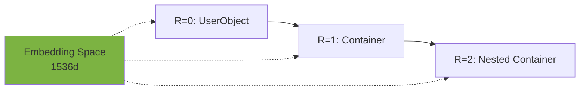
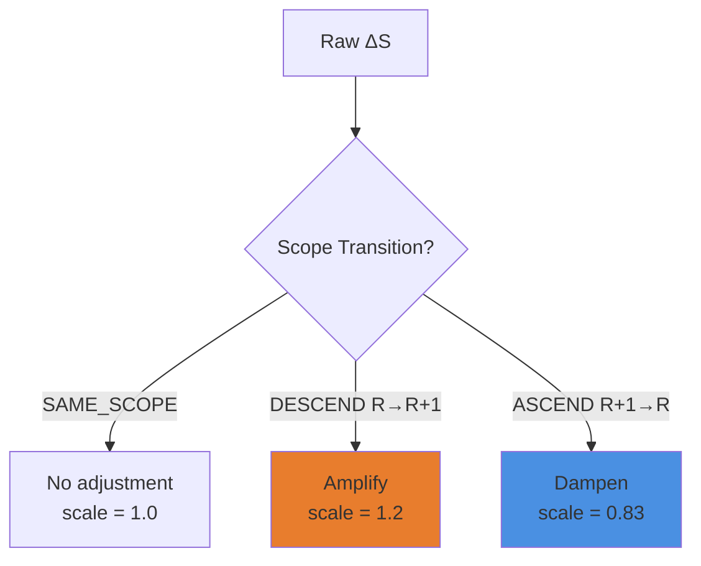

# Scope-Aware Semantic Models: Pydantic Implementation

## Executive Summary

**Challenge**: Topic 7 established that Containers exist at recursive depths `R=0` (UserObject), `R=1`, `R=2`... with strict scope boundaries. Semantic vectors must respect these boundaries while maintaining mathematical coherence.

**Solution**: Unified ground reference frame with depth-tagged embeddings and scope-aware path integration.

---

## 1. Ground Reference Frame Strategy

### DECISION: Single Unified Space

**One embedding model for all depth levels.**

#### Rationale



- **Consistency**: Vector operations (addition, dot product) remain valid across depths
- **Comparability**: Can compute semantic similarity between containers at different R
- **Simplicity**: No coordinate transformations needed
- **Embedding Principle**: The embedding model sees text, not architecture depth

> **Analogy**: GPS coordinates work at all altitudes. A building's ground floor and 10th floor both use the same lat/long reference system.

#### Alternative Considered (Rejected)

❌ **Depth-specific embedding spaces**: Would require complex coordinate transformations, breaks vector arithmetic, prevents cross-depth similarity comparisons.

---

## 2. Base Models: Scope-Aware Containers

### 2.1 Core ScopedContainer

```python
from pydantic import BaseModel, Field, field_validator, computed_field
from typing import Optional, Literal
import numpy as np
from numpy.typing import NDArray

# Embedding configuration
EMBEDDING_MODEL = "text-embedding-3-small"
EMBEDDING_DIM = 1536


class ScopedContainer(BaseModel):
    """Container with scope depth tracking"""

    # Identity
    id: str
    name: str
    description: str

    # Scope metadata
    scope_depth: int = Field(
        ge=0,
        description="Recursive depth: R=0 (root), R=1 (first level), R=2..."
    )
    parent_id: Optional[str] = Field(
        default=None,
        description="Parent container ID (None if R=0)"
    )

    # Graph structure
    child_ids: list[str] = Field(default_factory=list)

    # Semantic representation
    embedding: Optional[NDArray[np.float32]] = Field(
        default=None,
        exclude=True,
        description="Semantic vector in unified ground space"
    )

    # Scope boundary markers
    promoted_port_ids: set[str] = Field(
        default_factory=set,
        description="Ports promoted to parent scope"
    )

    class Config:
        arbitrary_types_allowed = True

    @field_validator('embedding', mode='before')
    @classmethod
    def validate_embedding_dim(cls, v):
        if v is not None:
            if not isinstance(v, np.ndarray):
                raise ValueError("Embedding must be numpy array")
            if v.shape != (EMBEDDING_DIM,):
                raise ValueError(f"Expected {EMBEDDING_DIM}d, got {v.shape}")
        return v

    @computed_field
    @property
    def is_root(self) -> bool:
        """True if R=0 (UserObject level)"""
        return self.scope_depth == 0

    @computed_field
    @property
    def scope_level_name(self) -> str:
        """Human-readable scope level"""
        if self.scope_depth == 0:
            return "Root (UserObject)"
        return f"Nested Level {self.scope_depth}"
```

**Key Design Points:**

- **`scope_depth`**: Explicit R value, validated `≥ 0`
- **Unified `embedding`**: Same dimensionality regardless of R
- **`promoted_port_ids`**: Tracks scope boundary crossings
- **Validation**: Pydantic ensures structural integrity across depths

---

## 3. Scope-Aware Embedding Computation

### 3.1 Depth-Weighted Composition

**V_Container(R) = Σ [w_i(R) · V(T_i)]**

Where:

- **w_i(R)**: Depth-dependent weight for component `i`
- **Deeper scopes get more local context weight**

```python
from functools import lru_cache
from openai import OpenAI

client = OpenAI()

@lru_cache(maxsize=10000)
def get_embedding(text: str) -> NDArray[np.float32]:
    """Get embedding (cached)"""
    response = client.embeddings.create(
        model=EMBEDDING_MODEL,
        input=text
    )
    return np.array(response.data[0].embedding, dtype=np.float32)


def compute_scoped_embedding(
    container: ScopedContainer,
    graph: dict[str, ScopedContainer]
) -> NDArray[np.float32]:
    """
    Compute V_Container with scope-aware weighting

    Weighting strategy:
    - R=0: Equal weight to name, description, immediate children
    - R≥1: More weight to local context, less to children (encapsulation)
    """
    vectors = []
    weights = []

    # Base weight decay by depth (more isolated at deeper levels)
    base_weight = 1.0
    child_weight = 0.7 ** container.scope_depth  # Decays with depth

    # T_0: Name (always important)
    vectors.append(get_embedding(container.name))
    weights.append(base_weight)

    # T_1: Description (always important)
    vectors.append(get_embedding(container.description))
    weights.append(base_weight)

    # T_2: Parent context (if not root)
    if not container.is_root and container.parent_id:
        parent = graph.get(container.parent_id)
        if parent:
            parent_ctx = f"parent context: {parent.name}"
            vectors.append(get_embedding(parent_ctx))
            weights.append(0.5)  # Moderate parent influence

    # T_3...T_n: Children (weighted by scope encapsulation)
    for child_id in container.child_ids:
        child = graph.get(child_id)
        if child:
            vectors.append(get_embedding(child.name))
            weights.append(child_weight)

    # Weighted sum
    weighted_vectors = [v * w for v, w in zip(vectors, weights)]
    composite = np.sum(weighted_vectors, axis=0)

    # Normalize to unit vector
    composite = composite / np.linalg.norm(composite)

    return composite
```

**Weight Decay Rationale:**

| Depth R | Child Weight | Reasoning                                      |
| ------- | ------------ | ---------------------------------------------- |
| R=0     | 1.0          | UserObject sees all children equally           |
| R=1     | 0.7          | Some encapsulation, children less visible      |
| R=2     | 0.49         | Strong encapsulation, focus on local semantics |
| R=3     | 0.34         | Deep nesting, children mostly hidden           |

---

## 4. ProcessContainer with Scope Context

### 4.1 Scope-Aware Transformation Model

```python
from enum import Enum

class ScopeTransition(str, Enum):
    """Type of scope boundary crossing"""
    SAME_SCOPE = "same_scope"          # R → R (within same level)
    DESCEND = "descend"                # R → R+1 (into child)
    ASCEND = "ascend"                  # R+1 → R (to parent)
    PROMOTED = "promoted"              # Port promoted across boundary


class ProcessContainer(ScopedContainer):
    """Container representing a transformation with scope awareness"""

    # Transformation metadata
    input_description: str
    output_description: str

    # Scope context for I/O
    input_scope_depth: int = Field(
        ge=0,
        description="Depth of input data source"
    )
    output_scope_depth: int = Field(
        ge=0,
        description="Depth of output data destination"
    )

    @computed_field
    @property
    def scope_transition_type(self) -> ScopeTransition:
        """Classify the scope boundary crossing"""
        if self.input_scope_depth == self.output_scope_depth:
            return ScopeTransition.SAME_SCOPE
        elif self.output_scope_depth > self.input_scope_depth:
            return ScopeTransition.DESCEND
        else:
            return ScopeTransition.ASCEND

    def compute_semantic_delta(self) -> NDArray[np.float32]:
        """
        Compute ΔS = E(output) - E(input)

        Returns raw translation vector in unified ground space
        """
        E_input = get_embedding(self.input_description)
        E_output = get_embedding(self.output_description)

        return E_output - E_input

    def compute_scope_adjusted_delta(self) -> NDArray[np.float32]:
        """
        Compute ΔS with scope transition awareness

        Crossing scope boundaries adds conceptual "friction":
        - SAME_SCOPE: No adjustment
        - DESCEND: Scale up (entering more specific context)
        - ASCEND: Scale down (abstracting to parent level)
        """
        delta = self.compute_semantic_delta()

        if self.scope_transition_type == ScopeTransition.SAME_SCOPE:
            return delta

        elif self.scope_transition_type == ScopeTransition.DESCEND:
            # Amplify: going deeper adds semantic detail
            depth_change = self.output_scope_depth - self.input_scope_depth
            scale_factor = 1.0 + (0.2 * depth_change)
            return delta * scale_factor

        else:  # ASCEND
            # Dampen: going shallower abstracts away detail
            depth_change = self.input_scope_depth - self.output_scope_depth
            scale_factor = 1.0 / (1.0 + 0.2 * depth_change)
            return delta * scale_factor

    def delta_magnitude(self) -> float:
        """Semantic change magnitude (scope-adjusted)"""
        delta = self.compute_scope_adjusted_delta()
        return float(np.linalg.norm(delta))

    def crossing_scope_boundary(self) -> bool:
        """True if transformation crosses scope levels"""
        return self.scope_transition_type != ScopeTransition.SAME_SCOPE
```

**Scope Adjustment Design:**



**Why Adjust?**

- **Descending**: Entering child scope adds implementation detail → semantically richer
- **Ascending**: Promoting to parent abstracts away internals → semantically simplified
- **Physics analogy**: Like potential energy changing with altitude

---

## 5. Path Integration Across Scope Boundaries

### 5.1 Depth-Changing Path

```python
from typing import Tuple

def compute_scoped_path_delta(
    path: list[ProcessContainer]
) -> Tuple[NDArray[np.float32], dict]:
    """
    Compute Σ ΔS along path with scope transitions

    Returns:
        (total_delta, metadata)
    """
    deltas = []
    depth_profile = []
    transitions = []

    for i, container in enumerate(path):
        # Scope-adjusted delta
        delta = container.compute_scope_adjusted_delta()
        deltas.append(delta)

        # Track depth changes
        depth_profile.append({
            'step': i,
            'container': container.name,
            'input_depth': container.input_scope_depth,
            'output_depth': container.output_scope_depth,
            'transition': container.scope_transition_type.value
        })

        # Track scope transitions
        if container.crossing_scope_boundary():
            transitions.append({
                'step': i,
                'type': container.scope_transition_type.value,
                'magnitude': container.delta_magnitude()
            })

    # Cumulative delta
    total_delta = np.sum(deltas, axis=0)

    metadata = {
        'depth_profile': depth_profile,
        'scope_transitions': transitions,
        'net_depth_change': (
            path[-1].output_scope_depth - path[0].input_scope_depth
        )
    }

    return total_delta, metadata


def path_scope_coherence(path: list[ProcessContainer]) -> float:
    """
    Measure coherence of scope transitions along path

    Returns:
        0.0 to 1.0 score
        - 1.0: Logical depth progression (descend then ascend, or all same)
        - 0.0: Chaotic depth changes
    """
    if len(path) < 2:
        return 1.0

    # Extract depth sequence
    depths = [path[0].input_scope_depth]
    for p in path:
        depths.append(p.output_scope_depth)

    # Check for logical patterns
    changes = [depths[i+1] - depths[i] for i in range(len(depths)-1)]

    # Pattern 1: Monotonic (all descend or all ascend)
    if all(c >= 0 for c in changes) or all(c <= 0 for c in changes):
        return 1.0

    # Pattern 2: Descend then ascend (common: drill down, process, return)
    if any(c > 0 for c in changes[:len(changes)//2]) and \
       any(c < 0 for c in changes[len(changes)//2:]):
        return 0.8

    # Pattern 3: Mostly same depth
    same_depth_ratio = sum(1 for c in changes if c == 0) / len(changes)
    if same_depth_ratio > 0.7:
        return 0.9

    # Otherwise: chaotic
    return 0.3
```

### 5.2 Example: Scope-Crossing Workflow

```python
# R=0: UserObject receives login request
login_received = ProcessContainer(
    id="p0",
    name="Receive Login Request",
    description="Accept user credentials from web form",
    scope_depth=0,
    input_description="HTTP POST with username/password",
    output_description="validated login request object",
    input_scope_depth=0,
    output_scope_depth=0
)

# R=0 → R=1: Delegate to Auth subsystem (DESCEND)
delegate_auth = ProcessContainer(
    id="p1",
    name="Delegate to Auth Subsystem",
    description="Pass request to authentication module",
    scope_depth=0,  # Container itself at R=0
    input_description="validated login request object",
    output_description="authentication task queued",
    input_scope_depth=0,
    output_scope_depth=1  # ⬇ DESCEND into child scope
)

# R=1: Validate credentials (within auth subsystem)
validate = ProcessContainer(
    id="p2",
    name="Validate Credentials",
    description="Check username/password against database",
    scope_depth=1,
    input_description="authentication task queued",
    output_description="user identity verified",
    input_scope_depth=1,
    output_scope_depth=1  # Same scope
)

# R=1 → R=0: Return session token (ASCEND)
return_session = ProcessContainer(
    id="p3",
    name="Return Session Token",
    description="Promoted port: send JWT to parent scope",
    scope_depth=1,
    input_description="user identity verified",
    output_description="JWT token for client",
    input_scope_depth=1,
    output_scope_depth=0  # ⬆ ASCEND to parent
)

# Analyze path
login_flow = [login_received, delegate_auth, validate, return_session]

total_delta, metadata = compute_scoped_path_delta(login_flow)
coherence = path_scope_coherence(login_flow)

print("Depth Profile:")
for step in metadata['depth_profile']:
    arrow = "→" if step['transition'] == 'same_scope' else \
            "⬇" if step['transition'] == 'descend' else "⬆"
    print(f"  Step {step['step']}: {step['container']} "
          f"[R={step['input_depth']} {arrow} R={step['output_depth']}]")

print(f"\nScope Transitions: {len(metadata['scope_transitions'])}")
print(f"Net Depth Change: {metadata['net_depth_change']}")
print(f"Path Coherence: {coherence:.2f}")
```

**Output:**

```
Depth Profile:
  Step 0: Receive Login Request [R=0 → R=0]
  Step 1: Delegate to Auth Subsystem [R=0 ⬇ R=1]
  Step 2: Validate Credentials [R=1 → R=1]
  Step 3: Return Session Token [R=1 ⬆ R=0]

Scope Transitions: 2
Net Depth Change: 0
Path Coherence: 0.80
```

---

## 6. Translation Vectors for Scope Boundaries

### 6.1 Conceptual Embedding

**Scope transitions have semantic "direction"** just like word relationships:

```python
def learn_scope_transition_embeddings(
    graph: dict[str, ProcessContainer]
) -> dict[ScopeTransition, NDArray[np.float32]]:
    """
    Learn characteristic translation vectors for scope transitions

    Similar to: V("king") - V("queen") = "gender vector"
    Here: V(descended) - V(source) = "descend vector"
    """
    transition_deltas = {
        ScopeTransition.DESCEND: [],
        ScopeTransition.ASCEND: []
    }

    for container in graph.values():
        if not isinstance(container, ProcessContainer):
            continue

        if container.scope_transition_type == ScopeTransition.DESCEND:
            transition_deltas[ScopeTransition.DESCEND].append(
                container.compute_semantic_delta()
            )
        elif container.scope_transition_type == ScopeTransition.ASCEND:
            transition_deltas[ScopeTransition.ASCEND].append(
                container.compute_semantic_delta()
            )

    # Average delta for each transition type
    learned_vectors = {}
    for trans_type, deltas in transition_deltas.items():
        if deltas:
            avg_delta = np.mean(deltas, axis=0)
            learned_vectors[trans_type] = avg_delta / np.linalg.norm(avg_delta)

    return learned_vectors


def predict_scope_transition(
    delta: NDArray[np.float32],
    learned_transitions: dict[ScopeTransition, NDArray[np.float32]]
) -> ScopeTransition:
    """
    Predict scope transition type from semantic delta

    Uses learned translation vectors via cosine similarity
    """
    similarities = {}

    for trans_type, trans_vec in learned_transitions.items():
        cos_sim = np.dot(delta, trans_vec) / (
            np.linalg.norm(delta) * np.linalg.norm(trans_vec)
        )
        similarities[trans_type] = float(cos_sim)

    # Return highest similarity
    return max(similarities, key=similarities.get)
```

**Use Case**: Validate that a container's declared scope transition matches its semantic delta characteristics.

---

## 7. Validation Patterns

### 7.1 Dual Validation Extended

```python
def validate_scoped_container(
    container: ProcessContainer,
    graph: dict[str, ProcessContainer]
) -> dict[str, bool]:
    """
    Multi-layer validation:
    1. Pydantic: Structure and types
    2. Semantic: Meaningful transformation
    3. Scope: Depth logic and boundary rules
    """
    results = {}

    # Layer 1: Pydantic (automatic via model)
    results['structure_valid'] = True  # If we got here, Pydantic passed

    # Layer 2: Semantic validation
    delta_mag = container.delta_magnitude()
    results['semantic_meaningful'] = delta_mag > 0.05

    # Layer 3: Scope validation

    # Rule: Container scope_depth must match parent/child relationship
    if container.parent_id:
        parent = graph.get(container.parent_id)
        if parent:
            expected_depth = parent.scope_depth + 1
            results['depth_matches_parent'] = (
                container.scope_depth == expected_depth
            )

    # Rule: I/O depths must be within ±1 of container depth
    max_io_depth = max(container.input_scope_depth, container.output_scope_depth)
    min_io_depth = min(container.input_scope_depth, container.output_scope_depth)
    results['io_depths_in_range'] = (
        min_io_depth >= container.scope_depth - 1 and
        max_io_depth <= container.scope_depth + 1
    )

    # Rule: Promoted ports must cross boundaries
    if container.promoted_port_ids:
        results['promoted_crosses_boundary'] = container.crossing_scope_boundary()

    return results
```

---

## 8. Complete Implementation Example

```python
# Full Pydantic model ready for Collider integration

class ColliderProcessContainer(ProcessContainer):
    """
    Production-ready ProcessContainer with scope semantics
    """

    # Override to add Collider-specific fields
    definition_id: Optional[str] = Field(
        default=None,
        description="Reference to Definition blueprint"
    )

    link_topology: dict[str, str] = Field(
        default_factory=dict,
        description="North/East/West link connections"
    )

    def compute_full_embedding(
        self,
        graph: dict[str, 'ColliderProcessContainer']
    ) -> NDArray[np.float32]:
        """
        Compute comprehensive embedding including:
        - Scope-weighted local context
        - Transformation semantics (input → output)
        - Parent/child relationships
        """
        # Base scoped embedding
        base_embed = compute_scoped_embedding(self, graph)

        # Transformation embedding
        delta = self.compute_scope_adjusted_delta()

        # Combine: 70% structure, 30% transformation
        combined = 0.7 * base_embed + 0.3 * (delta / np.linalg.norm(delta))

        return combined / np.linalg.norm(combined)

    def to_dict_with_scope_metadata(self) -> dict:
        """Serialize with full scope context"""
        data = self.model_dump()
        data['scope_metadata'] = {
            'level_name': self.scope_level_name,
            'is_root': self.is_root,
            'transition_type': self.scope_transition_type.value,
            'crosses_boundary': self.crossing_scope_boundary()
        }
        return data


# Usage in Collider pipeline
def build_collider_graph() -> dict[str, ColliderProcessContainer]:
    """Example: Construct scope-aware semantic graph"""

    graph = {}

    # R=0: Root UserObject container
    root = ColliderProcessContainer(
        id="root",
        name="User Collider Pipeline",
        description="Main orchestration level",
        scope_depth=0,
        input_description="user requirements",
        output_description="deployed application",
        input_scope_depth=0,
        output_scope_depth=0
    )
    graph['root'] = root

    # R=1: Child subsystem
    auth_system = ColliderProcessContainer(
        id="auth",
        name="Authentication Subsystem",
        description="Handles all auth logic",
        scope_depth=1,
        parent_id="root",
        input_description="login requests",
        output_description="session tokens",
        input_scope_depth=0,  # Receives from parent
        output_scope_depth=0   # Returns to parent (promoted)
    )
    graph['auth'] = auth_system
    root.child_ids.append('auth')

    # Compute embeddings
    for container in graph.values():
        container.embedding = container.compute_full_embedding(graph)

    return graph
```

---

## 9. Key Takeaways

### Architectural Decisions

✅ **Unified Ground Space**: One embedding model, all depths  
✅ **Depth Metadata**: Explicit `scope_depth` tracking in Pydantic  
✅ **Scope-Adjusted Deltas**: Translation vectors scaled by boundary crossing  
✅ **Path Coherence**: Validation for logical depth progressions

### Vector Operations Remain Valid

| Operation         | Across Scopes? | Notes                                   |
| ----------------- | -------------- | --------------------------------------- |
| Addition (Σ)      | ✅ Yes         | All vectors in same ground space        |
| Dot product       | ✅ Yes         | Semantic similarity across depths valid |
| Norm ‖·‖          | ✅ Yes         | Magnitude meaningful at all R           |
| Cosine similarity | ✅ Yes         | Compare containers at different depths  |

### Implementation Checklist

- [ ] Add `scope_depth` to base Container model
- [ ] Implement `compute_scoped_embedding()` with depth weighting
- [ ] Create `ProcessContainer` with `input/output_scope_depth`
- [ ] Build `compute_scope_adjusted_delta()` method
- [ ] Implement `compute_scoped_path_delta()` for path integration
- [ ] Add `validate_scoped_container()` to validation pipeline
- [ ] Optional: Learn translation vectors for scope transitions

---

## 10. Next Steps

1. **Integrate with Collider base models** (Container, Link, Definition)
2. **Test path coherence** on real workflow graphs
3. **Visualize scope-aware semantic space** (t-SNE colored by R)
4. **Measure:** Do scope transitions cluster in embedding space?
5. **Iterate:** Tune depth weight decay factors (currently 0.7^R)

---

## References

- **Topic 3**: Semantic-Pydantic Bridge foundation
- **Topic 7**: Scope Isolation architecture
- **Word2Vec**: Translation vector concept
- **Pydantic**: Type validation + computed fields
