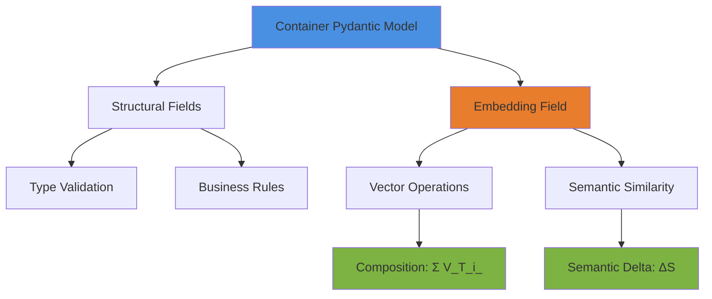

# Semantic-Pydantic Bridge: Implementation Guide

## The Core Challenge

The Collider needs to operate in **two worlds simultaneously**:

1. **Symbolic World** (Pydantic): Strict types, validation rules, schema enforcement
2. **Semantic World** (Embeddings): Continuous vector spaces, fuzzy similarity, meaning representation

**The Bridge**: Attach semantic vectors to Pydantic models without sacrificing validation rigor.

---

## Architecture Overview



---

## 1. The Ground Reference Frame

### Concept

The "Ground" is the **latent space of your embedding model** (e.g., OpenAI `text-embedding-3-small`, Sentence-BERT, etc.).

- **Dimensionality**: Fixed (e.g., 384d, 768d, 1536d)
- **Properties**: All semantic operations happen in this consistent coordinate system
- **Analogy**: Like GPS coordinates - every location has lat/long in the same WGS84 reference frame

### Why Critical?

You can't add vectors from different embedding models (like adding miles to kilometers). **Pick ONE embedding model** and stick with it for the entire graph.

```python
from typing import Literal

# Configuration
EMBEDDING_MODEL: Literal["text-embedding-3-small"] = "text-embedding-3-small"
EMBEDDING_DIM: int = 1536  # Dimension determined by model
```

---

## 2. Pydantic Model with Embeddings

### Basic Pattern

```python
from pydantic import BaseModel, Field, field_validator
from typing import Optional
import numpy as np
from numpy.typing import NDArray

class SemanticContainer(BaseModel):
    """Container with both structure and semantics"""

    # Structural fields (validated)
    id: str
    name: str
    description: str

    # Semantic field (optional, computed)
    embedding: Optional[NDArray[np.float32]] = Field(
        default=None,
        exclude=True,  # Don't serialize by default
        description="Semantic vector representation"
    )

    # Parent/child relationships
    parent_id: Optional[str] = None
    child_ids: list[str] = Field(default_factory=list)

    class Config:
        arbitrary_types_allowed = True  # Allow numpy arrays

    @field_validator('embedding', mode='before')
    @classmethod
    def validate_embedding_dim(cls, v):
        """Ensure embedding has correct dimensionality"""
        if v is not None:
            if not isinstance(v, np.ndarray):
                raise ValueError("Embedding must be numpy array")
            if v.shape != (EMBEDDING_DIM,):
                raise ValueError(
                    f"Embedding must be {EMBEDDING_DIM}d, got {v.shape}"
                )
        return v
```

**Key Design Choices:**

1. **`arbitrary_types_allowed`**: Lets Pydantic accept numpy arrays
2. **`exclude=True`**: Embeddings are large; don't serialize to JSON automatically
3. **Validator**: Enforces dimensionality even in fuzzy vector space
4. **`Optional`**: Embeddings computed lazily, not required at creation

---

## 3. Computing Container Embeddings: V_Container = Σ V(T_i)

### The Formula Explained

**V_Container = Σ V(T_i)**

Where:

- **V_Container**: The composite embedding for the entire container
- **T_i**: Individual text components (name, description, child names, etc.)
- **V(T_i)**: Embedding vector for component `i`
- **Σ**: Vector addition (element-wise summation)

### Word2Vec Compositional Principle

Word2Vec discovered that **vector addition captures semantic composition**:

- `V("king") - V("man") + V("woman") ≈ V("queen")`
- `V("Paris") - V("France") + V("Japan") ≈ V("Tokyo")`

This **additive compositionality** works because the latent space encodes semantic relationships via linear offsets.

### Implementation

```python
from openai import OpenAI
from functools import lru_cache

client = OpenAI()

@lru_cache(maxsize=10000)
def get_embedding(text: str) -> NDArray[np.float32]:
    """Get embedding for text (cached)"""
    response = client.embeddings.create(
        model=EMBEDDING_MODEL,
        input=text
    )
    return np.array(response.data[0].embedding, dtype=np.float32)


def compute_container_embedding(container: SemanticContainer) -> NDArray[np.float32]:
    """
    Compute V_Container = Σ V(T_i)

    Components:
    - T_0: Container name
    - T_1: Container description
    - T_2...T_n: Child container names (if present)
    """
    vectors = []

    # T_0: Name
    vectors.append(get_embedding(container.name))

    # T_1: Description
    vectors.append(get_embedding(container.description))

    # T_2...T_n: Child identifiers (names would be better if available)
    for child_id in container.child_ids:
        # In real impl, fetch child names from graph
        vectors.append(get_embedding(f"child_{child_id}"))

    # Σ: Element-wise sum
    composite = np.sum(vectors, axis=0)

    # Optional: Normalize to unit vector
    composite = composite / np.linalg.norm(composite)

    return composite


# Usage
container = SemanticContainer(
    id="c1",
    name="User Authentication",
    description="Handles login, logout, and session management"
)

container.embedding = compute_container_embedding(container)
```

**Why Normalization?**

- Raw sums grow with number of components
- Normalized vectors preserve direction (semantic meaning) but consistent magnitude
- Enables fair cosine similarity comparisons

---

## 4. Semantic Delta: ΔS = E(output) - E(input)

### The Transformation Concept

A **process container** transforms inputs → outputs. The **semantic delta** measures:

> "How much semantic meaning changed during this transformation?"

**ΔS = E(output) - E(input)**

Where:

- **E(output)**: Embedding of the output state/data
- **E(input)**: Embedding of the input state/data
- **ΔS**: Translation vector in latent space

### Translation Vectors (Word2Vec Analogy)

Word2Vec showed **relationships are vectors**:

- `V("king") - V("queen")` = gender vector
- `V("Paris") - V("France")` = capital relationship vector

Similarly, **ΔS captures the transformation relationship**:

- Input: "raw user credentials"
- Output: "authenticated session token"
- ΔS: "authentication transformation" vector

### Implementation

```python
class ProcessContainer(SemanticContainer):
    """Container representing a data transformation process"""

    input_description: str
    output_description: str

    def compute_semantic_delta(self) -> NDArray[np.float32]:
        """
        Compute ΔS = E(output) - E(input)

        Returns:
            Translation vector representing semantic transformation
        """
        E_input = get_embedding(self.input_description)
        E_output = get_embedding(self.output_description)

        delta = E_output - E_input

        return delta

    def delta_magnitude(self) -> float:
        """How much semantic change? (Euclidean distance)"""
        delta = self.compute_semantic_delta()
        return float(np.linalg.norm(delta))

    def delta_direction(self) -> NDArray[np.float32]:
        """What type of change? (normalized direction)"""
        delta = self.compute_semantic_delta()
        return delta / np.linalg.norm(delta)


# Example
auth_process = ProcessContainer(
    id="p1",
    name="Authentication Process",
    description="Validates credentials and creates session",
    input_description="username and password credentials",
    output_description="JWT authentication token with user session"
)

delta = auth_process.compute_semantic_delta()
magnitude = auth_process.delta_magnitude()  # How much change
direction = auth_process.delta_direction()  # What kind of change

print(f"Semantic change magnitude: {magnitude:.4f}")
```

**Use Cases:**

1. **Finding similar transformations**: Containers with similar ΔS perform similar semantic work
2. **Path coherence**: Chained ΔS vectors should form logical progression
3. **Anomaly detection**: Unexpected ΔS suggests process doesn't match expected transformation

---

## 5. Path Integration: Cumulative Transformation

### The Graph Path Problem

Given a chain of containers: **A → B → C → D**

Each has semantic delta: **ΔS_AB, ΔS_BC, ΔS_CD**

**Question**: What's the total semantic transformation from A to D?

### Vector Addition Solution

**ΔS_total = ΔS_AB + ΔS_BC + ΔS_CD**

This is **path integration in vector space**:

```python
def compute_path_delta(
    path: list[ProcessContainer]
) -> NDArray[np.float32]:
    """
    Compute cumulative semantic transformation along path

    Args:
        path: Ordered list of process containers

    Returns:
        Total semantic delta vector
    """
    deltas = [container.compute_semantic_delta() for container in path]

    # Vector summation
    total_delta = np.sum(deltas, axis=0)

    return total_delta


def path_coherence_score(path: list[ProcessContainer]) -> float:
    """
    Measure semantic coherence of transformation path

    Returns:
        0.0 to 1.0, where 1.0 = perfect linear transformation
    """
    deltas = [container.compute_semantic_delta() for container in path]

    if len(deltas) < 2:
        return 1.0

    # Compute pairwise cosine similarities
    similarities = []
    for i in range(len(deltas) - 1):
        cos_sim = np.dot(deltas[i], deltas[i+1]) / (
            np.linalg.norm(deltas[i]) * np.linalg.norm(deltas[i+1])
        )
        similarities.append(cos_sim)

    # Average similarity
    return float(np.mean(similarities))


# Example: Multi-step authentication flow
login_path = [
    ProcessContainer(
        id="p1",
        name="Validate Credentials",
        description="Check username/password",
        input_description="raw login form data",
        output_description="validated user identity"
    ),
    ProcessContainer(
        id="p2",
        name="Create Session",
        description="Generate session token",
        input_description="validated user identity",
        output_description="active user session"
    ),
    ProcessContainer(
        id="p3",
        name="Issue JWT",
        description="Encode session as JWT token",
        input_description="active user session",
        output_description="signed JWT authentication token"
    )
]

total_transformation = compute_path_delta(login_path)
coherence = path_coherence_score(login_path)

print(f"Path coherence: {coherence:.4f}")  # Should be high for logical flow
```

**Coherence Interpretation:**

- **> 0.8**: Semantically consistent pipeline
- **0.5 - 0.8**: Related but distinct transformations
- **< 0.5**: Potentially unrelated steps, investigate logic

---

## 6. Hybrid Validation: Best of Both Worlds

### The Power of the Bridge

You now have **two orthogonal validation mechanisms**:

#### Symbolic Validation (Pydantic)

```python
# This WILL raise validation error
bad_container = SemanticContainer(
    id=123,  # ❌ Type error: expected str
    name="Test"
)
```

#### Semantic Validation (Custom)

```python
def validate_semantic_consistency(
    container: ProcessContainer,
    min_delta_magnitude: float = 0.1
) -> bool:
    """Check if transformation is semantically meaningful"""

    magnitude = container.delta_magnitude()

    if magnitude < min_delta_magnitude:
        # Input and output are semantically identical
        # This process might be redundant
        return False

    return True


# Semantic check
container = ProcessContainer(
    id="p1",
    name="Copy Data",
    description="Copies data unchanged",
    input_description="user data",
    output_description="user data"  # Same as input!
)

# Pydantic: ✅ Valid structure
# Semantic: ❌ ΔS ≈ 0, redundant transformation
is_meaningful = validate_semantic_consistency(container)
```

---

## 7. Practical Integration Patterns

### Pattern 1: Lazy Computation

```python
class LazySemanticContainer(SemanticContainer):
    """Compute embedding on-demand"""

    _embedding_cache: Optional[NDArray[np.float32]] = None

    @property
    def embedding(self) -> NDArray[np.float32]:
        if self._embedding_cache is None:
            self._embedding_cache = compute_container_embedding(self)
        return self._embedding_cache

    def invalidate_embedding(self):
        """Call when structural fields change"""
        self._embedding_cache = None
```

### Pattern 2: Batch Processing

```python
def compute_embeddings_batch(
    containers: list[SemanticContainer]
) -> dict[str, NDArray[np.float32]]:
    """Compute all embeddings in one API call"""

    # Gather all text components
    texts = []
    for c in containers:
        texts.extend([c.name, c.description])

    # Single API call
    response = client.embeddings.create(
        model=EMBEDDING_MODEL,
        input=texts
    )

    # Distribute vectors back
    embeddings = {}
    idx = 0
    for c in containers:
        name_vec = np.array(response.data[idx].embedding)
        desc_vec = np.array(response.data[idx + 1].embedding)
        embeddings[c.id] = (name_vec + desc_vec) / 2
        idx += 2

    return embeddings
```

### Pattern 3: Persistence

```python
import json

def serialize_container(container: SemanticContainer) -> dict:
    """Serialize with embedding"""
    data = container.model_dump()

    # Add embedding as base64
    if container.embedding is not None:
        import base64
        embedding_bytes = container.embedding.tobytes()
        data['embedding_b64'] = base64.b64encode(embedding_bytes).decode()

    return data


def deserialize_container(data: dict) -> SemanticContainer:
    """Restore with embedding"""
    import base64

    if 'embedding_b64' in data:
        embedding_bytes = base64.b64decode(data['embedding_b64'])
        embedding = np.frombuffer(embedding_bytes, dtype=np.float32)
        data['embedding'] = embedding
        del data['embedding_b64']

    return SemanticContainer(**data)
```

---

## 8. Advanced: Composite Graph Embeddings

### Full Graph Traversal

```python
from collections import deque

def compute_subgraph_embedding(
    root: SemanticContainer,
    graph: dict[str, SemanticContainer],
    max_depth: int = 3
) -> NDArray[np.float32]:
    """
    Compute embedding for entire subgraph via BFS

    V_subgraph = Σ V(container_i) with depth decay
    """
    visited = set()
    queue = deque([(root.id, 0)])  # (id, depth)
    vectors = []

    while queue:
        container_id, depth = queue.popleft()

        if container_id in visited or depth > max_depth:
            continue

        visited.add(container_id)
        container = graph[container_id]

        # Decay factor: deeper nodes contribute less
        weight = 0.5 ** depth
        weighted_vec = container.embedding * weight
        vectors.append(weighted_vec)

        # Add children to queue
        for child_id in container.child_ids:
            queue.append((child_id, depth + 1))

    # Composite embedding
    subgraph_vec = np.sum(vectors, axis=0)
    subgraph_vec = subgraph_vec / np.linalg.norm(subgraph_vec)

    return subgraph_vec
```

---

## 9. Key Takeaways

### What We Achieved

✅ **Dual Validation**: Structural (Pydantic) + Semantic (vectors)  
✅ **Compositional Semantics**: `V_Container = Σ V(T_i)` via vector addition  
✅ **Transformation Tracking**: `ΔS = E(output) - E(input)` captures process semantics  
✅ **Path Integration**: Cumulative ΔS along graph paths  
✅ **Ground Reference**: Consistent embedding model latent space

### When to Use Each

**Pydantic Validation** → Structure, types, business rules  
**Semantic Validation** → Meaning, similarity, transformation coherence

### Next Steps

1. **Choose embedding model** (recommend `text-embedding-3-small` for cost/perf)
2. **Implement base `SemanticContainer`** class
3. **Add embedding computation** to container creation pipeline
4. **Build semantic search** over container graph
5. **Implement path coherence checks** for workflow validation

---

## References

- **Word2Vec**: Mikolov et al. (2013) - "Efficient Estimation of Word Representations in Vector Space"
- **Pydantic AI Embeddings**: https://ai.pydantic.dev/embeddings/
- **Compositional Semantics**: Stanford NLP course materials
- **Neuro-Symbolic AI**: Imperial College survey (linked in research)
