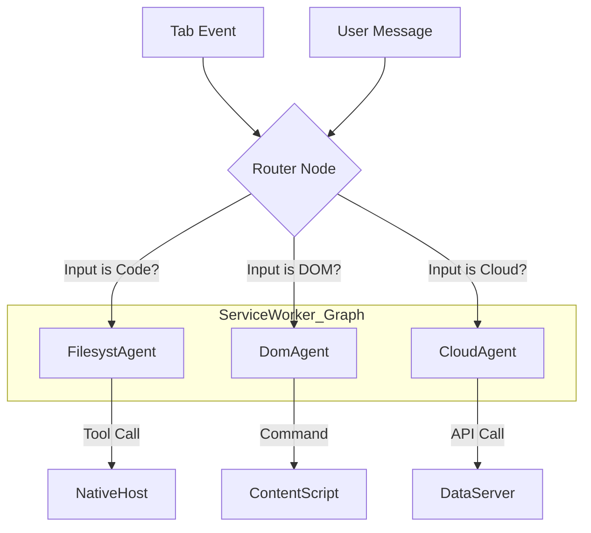

# LangGraph.js Topology & Routing

> How the graph handles multi-tab, multi-agent routing.

## The Challenge

A single Chrome Extension Service Worker must manage multiple independent conversations across multiple tabs, effectively acting as multiple "Agents" simultaneously.

## Solution: Thread-ID as Tab-ID

In LangGraph, every execution state is keyed by a `thread_id`. We map:
`thread_id` = `tab_id`

## Topology



## Multi-Tab State Management

The Graph object is a **Singleton** in the Service Worker, but the **State** is sharded by Thread ID.

```javascript
// Service Worker Code
const graph = compileGraph(...);

chrome.runtime.onMessage.addListener((msg, sender) => {
  const tabId = sender.tab.id;

  // Resume the graph for THIS specific tab
  const state = await graph.invoke(
    { messages: [msg] },
    { configurable: { thread_id: String(tabId) } }
  );
});
```

## Routing Logic (The "Brain")

The **Supervisor Node** (Router) looks at the input and the **Architecture Context** (Manifests) to decide who handles it.

- **IF** user asks "Refactor utils.py"
- **AND** `FFS1 (Filesyst)` context is loaded
- **THEN** Route to `FilesystAgent`

- **IF** user asks "Click the signup button"
- **THEN** Route to `DomAgent` -> `Content Script`
