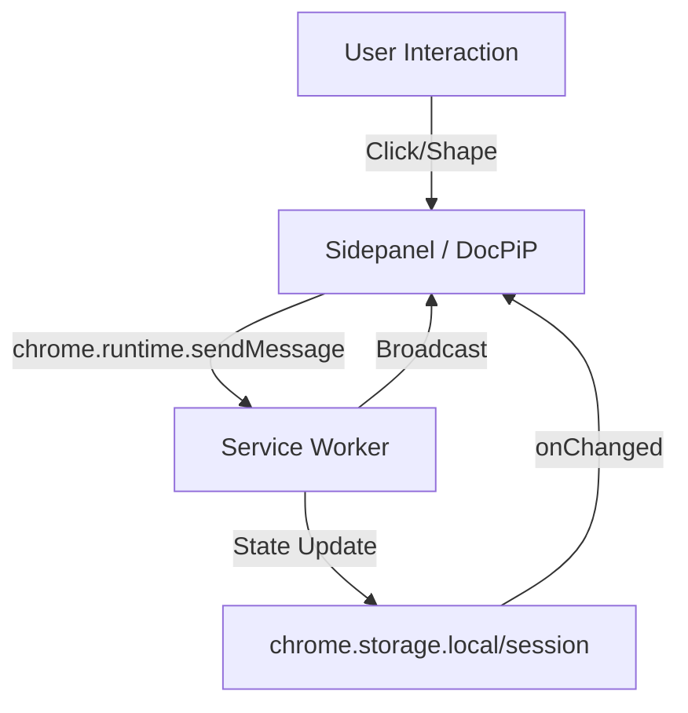

# UI Architecture: Sidepanel & DocPiP

> Architecture for the "Always-on" Agent Interface.

## Components

### 1. Sidepanel

- **Type**: `chrome.sidePanel`
- **Context**: Tab-specific or Global.
- **Use Case**: Contextual tools, file explorer, chat for the specific tab.
- **Lifecycle**: Tied to the browser window.

### 2. DocPiP (Document Picture-in-Picture)

- **Type**: `window.documentPictureInPicture`
- **Context**: Global, floats over everything (OS-level).
- **Use Case**: "Avatar" mode, persistent status, voice interaction.
- **Lifecycle**: Independent of main browser window (to an extent).

## Communication Flow

All UI components are "Dumb Views". Logic lives in the Service Worker (SW) or Offscreen Document.

## State Synchronization

We use a **Reactive Store Pattern** (e.g., Zustand wrapped with storage sync).

1.  **Action**: User clicks "Analyze" in Sidepanel.
2.  **Message**: `sendMessage({ type: 'ANALYZE_CLICKED', payload: ... })` sent to SW.
3.  **Process**: SW logic (or LangGraph) processes the intent.
4.  **Update**: SW updates `agentState` in `chrome.storage.session`.
5.  **Re-render**: Both Sidepanel and DocPiP listen to storage changes and re-render the UI.

## routing & DocPiP

- **DocPiP as "Remote Control"**: DocPiP can show the "Active Agent" state.
- If user switches tabs, DocPiP updates to show context of the _new_ active tab (via `tabs.onActivated` in SW).
